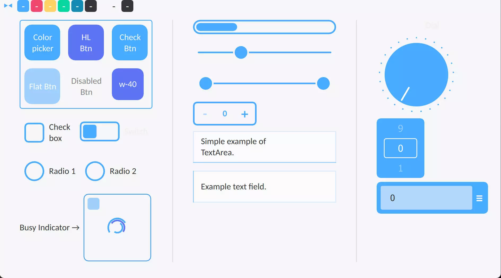
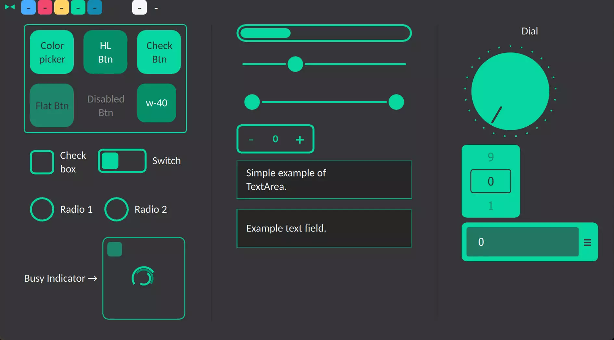

# QML SnowWhite.

<br>

**Snow White** QtQuick2 theme.<br>
*Tired of the same UI for QtQuick2?* Here is my own UI for the most common components, which you can simply utilize.<br>
You may also swap and change between color variations; the implementation is well-formed for color changes, and it is also simple to do.<br>
*If you liked these components, please consider making a donation.*
## Preview

<div align="center">&nbsp;

<br>


</div>

## How to use

### Attention!

This component has only been tested on _Qt version 5.15.2_ and _Windows OS_ at _3840x2160 resolution_ with a _scaling factor of 250 percent_; USAGE OF THIS COMPONENT CARRIES NO **_WARRANTY_**.

### Usage

Clone the repository first.

```bash
git clone https://github.com/SMR76/qml-snow-white.git
```

Then include `SnowWhite.pri` in your project. <sub>[see example-1](example/example-1/example-1.pro#L11)</sub>

```make
include('path/to/SnowWhite.pri')
```

Add `qrc:/` to the engine import path. <sub>[see example-1](example/example-1/main.cpp#L17)</sub>

```cpp
engine.addImportPath("qrc:/");
```

And finally import the `SnowWhite` module. <sub>[see example-1](example/example-1/main.qml#L6)</sub>

```qml
import SnowWhite 1.0
```

If you are confused, please refer to [example-1](example/example-1/) for a clearer understanding of what you should do.

## Components

<details open>
<summary> Available</summary>

- [x] Button
- [x] Radio Button
- [x] CheckBox
- [x] Slider
- [x] TextArea
- [x] TextField
- [x] ProgressBar
- [x] RadioButton
- [x] Switch
- [x] RangeSlider
- [x] SpinBox
- [x] Tumbler
- [x] Dial
- [x] BusyIndicator
- [x] SplitView
- [x] StackView
- [x] ComboBox

</details>

## Issues

Please file an issue on [issues page](https://github.com/SMR76/qml-snow-white/issues) if you have any problems.

## Documentation

[Documentation](docs/README.md) can be found in the `docs` directory.

## Donation

&emsp; <a href="https://www.blockchain.com/bch/address/bitcoincash:qrnwtxsk79kv6mt2hv8zdxy3phkqpkmcxgjzqktwa3">
</a>

## License

&emsp; <a href="https://spdx.org/licenses/GPL-3.0-or-later.html">
</a>
